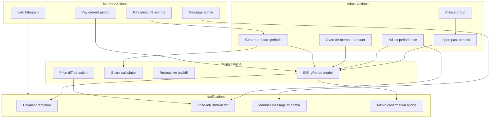

# Billing UX Overhaul

## Phase 1 — UI Reorganization & Navigation (quick wins)

### Sidebar cleanup

File: `[src/components/layout/app-sidebar.tsx](src/components/layout/app-sidebar.tsx)`

- Remove "Profile" and "Settings" from the main nav items list
- Turn the existing footer user section into a **popover menu** (click avatar/name to reveal Profile, Settings, Sign out)
- Keep sidebar nav as: Dashboard, Groups, Activity, Payments, Notifications
- Optionally group "Activity" and "Notifications" under a collapsible "Monitor" section if clutter remains

### Group detail page — reorder sections

File: `[src/app/(dashboard)/dashboard/groups/[groupId]/page.tsx](src/app/(dashboard)`/dashboard/groups/[groupId]/page.tsx)

Current order: header → stats → billing setup + workflow + invite → members → PaymentMatrix → notifications

New order:

1. Header (unchanged)
2. Stats cards (add "Total outstanding" card)
3. **PaymentMatrix** (promoted to top — the core tool)
4. Members panel
5. Billing setup + workflow + invite
6. Notifications panel — **collapsed by default** using a `<Collapsible>` from shadcn, or moved to a sub-tab/subpage

### Member financial summary

File: `[src/components/features/groups/member-group-view.tsx](src/components/features/groups/member-group-view.tsx)`

- Add a prominent summary card at the top showing: total paid, total pending, total overdue, next due date
- Pull data from the billing periods already fetched for PaymentMatrix

---

## Phase 2 — Per-Period Price Overrides with Reasons

### Data model change

File: `[src/models/billing-period.ts](src/models/billing-period.ts)`

Add to the `memberPaymentSchema`:

```typescript
adjustedAmount: { type: Number, default: null },
adjustmentReason: { type: String, default: null },
```

- `adjustedAmount` — admin override of the calculated share for this specific period+member
- `adjustmentReason` — free-text explanation (e.g., "price increase for this month", "promo ended")
- When `adjustedAmount` is set, it takes precedence over `amount` for display and notifications
- The original `amount` stays as the baseline for audit

Also add a period-level field:

```typescript
priceNote: { type: String, default: null },
```

For a blanket reason that applies to the whole period (e.g., "annual price hike").

### API change

File: `[src/app/api/groups/[groupId]/billing/[periodId]/route.ts](src/app/api/groups/[groupId]/billing/[periodId]/route.ts)`

Extend the PATCH endpoint to accept per-payment `adjustedAmount` and `adjustmentReason`, plus period-level `priceNote`. Validate with Zod.

### Notification templates

Files: `[src/lib/email/templates/payment-reminder.ts](src/lib/email/templates/payment-reminder.ts)`, `[src/lib/telegram/send.ts](src/lib/telegram/send.ts)`

- When `adjustmentReason` or `priceNote` exists, include it in the reminder email and Telegram message (e.g., a highlighted callout box in email, a line in Telegram)

### PaymentMatrix UI

File: `[src/components/features/billing/payment-matrix.tsx](src/components/features/billing/payment-matrix.tsx)`

- Admin: add ability to click a cell and set `adjustedAmount` + `adjustmentReason` via a small dialog/popover
- Show an indicator icon on cells with adjustments; tooltip shows the reason
- Period column: show `priceNote` as a tooltip or small badge

---

## Phase 3 — Retroactive & Advance Billing

### Retroactive period backfill

When a member is added with a `billingStartsAt` in the past (or admin sets it retroactively), the system should generate billing entries for all past periods that the member missed.

**API change** — file: `[src/app/api/groups/[groupId]/members/route.ts](src/app/api/groups/[groupId]/members/route.ts)` (POST add member)

After adding a member with past `billingStartsAt`:

1. Find all existing `BillingPeriod` docs for this group where `periodStart >= billingStartsAt`
2. For each period that doesn't already include this member in `payments[]`, add a payment entry with status `pending` and the calculated amount
3. Return the count of backfilled periods in the response

Also extend the member PATCH endpoint to trigger backfill when `billingStartsAt` is changed to an earlier date.

**Calculator integration** — the existing `calculateShares()` already respects `memberBillingStart()`, so new period creation will naturally include the member. The backfill only covers *already-existing* periods.

### Advance payment (create future periods)

**New API endpoint**: `POST /api/groups/[groupId]/billing/advance`

```typescript
// request body
{
  monthsAhead: number; // 1-12
  memberId?: string;   // optional: only for a specific member
}
```

Logic:

1. Calculate the next N period date ranges using `getPeriodDates()` and the group's `cycleDay`
2. For each future month, check if a `BillingPeriod` already exists
3. If not, create it with `calculateShares()` — include all active members whose billing has started
4. Return the created periods so the UI can show them for payment

**Price-change diff detection** — when the group price is updated:

File: `[src/app/api/groups/[groupId]/route.ts](src/app/api/groups/[groupId]/route.ts)` (PATCH)

After price change:

1. Find all future `BillingPeriod` docs where `periodStart > now`
2. For periods with payments in `confirmed` status (pre-paid): calculate the new share, compute delta = newAmount - paidAmount
3. If delta > 0: set `adjustedAmount = newAmount`, `adjustmentReason = "price updated from {old} to {new}"`, reset status to `pending` (or create a supplementary payment entry for the diff — cleaner approach)
4. Notify affected members about the difference via their preferred channel

**Decision on diff handling**: Rather than resetting confirmed payments, add a **new payment entry** to the same period for the same member with `amount = delta` and `adjustmentReason`. This preserves the original payment record. The period's `isFullyPaid` check would need to account for all entries per member.

### UI for advance payment

File: `[src/components/features/billing/payment-matrix.tsx](src/components/features/billing/payment-matrix.tsx)` (or new component)

- Admin: "Generate upcoming periods" button above PaymentMatrix → dialog to choose how many months (1-12)
- Member portal: "Pay ahead" button → shows upcoming periods they can mark as paid

---

## Phase 4 — Member Portal Enhancements

### Telegram linking on member page

File: `[src/app/(public)/member/[token]/page.tsx](src/app/(public)`/member/[token]/page.tsx)

- Add a "Connect Telegram" card below the payment info
- Uses the existing `/api/telegram/link` flow but adapted for the token-based portal (no auth session)
- New endpoint: `POST /api/member/[token]/telegram-link` that creates a link code for the member's user account (if they have one) and returns the deep link
- If the member has no user account, show a prompt to register first or link via the Telegram invite flow

### Contact admin form

File: `[src/components/features/groups/member-group-view.tsx](src/components/features/groups/member-group-view.tsx)`

- Add a "Message admin" card or floating button
- Simple form: subject (optional) + message textarea + send button

**New API endpoint**: `POST /api/groups/[groupId]/messages`

```typescript
{
  message: string;
  subject?: string;
  memberToken?: string; // for unauthenticated portal access
}
```

Logic:

1. Identify the member (from auth session or portal token)
2. Load the group and admin
3. Send notification to admin via their preferred channel (email and/or Telegram)
4. Log in a new `MemberMessage` collection (or lightweight — just the `Notification` model with type `member_message`)

**Notification template**: simple email with member name, group name, and message body. Telegram: plain text with same info.

---

## Phase 5 — Group History Import

### Group creation/edit with historical periods

File: `[src/components/features/groups/group-form.tsx](src/components/features/groups/group-form.tsx)`

Add an optional "Import history" section (collapsible, shown in both create and edit modes):

- A dynamic form where admin can add past billing periods:
  - Period label (auto-generated from date, editable)
  - Period start/end dates
  - Total price
  - Per-member status (confirmed, pending, waived) + amount
- "Add period" button to add rows
- On submit, bulk-create `BillingPeriod` documents via a new endpoint

**New API endpoint**: `POST /api/groups/[groupId]/billing/import`

```typescript
{
  periods: Array<{
    periodLabel: string;
    periodStart: string; // ISO date
    periodEnd: string;
    totalPrice: number;
    payments: Array<{
      memberEmail: string;
      amount: number;
      status: "confirmed" | "pending" | "waived";
    }>;
  }>;
}
```

Validate that periods don't overlap with existing ones. Create in bulk.

### PriceHistory integration

File: `[src/models/price-history.ts](src/models/price-history.ts)` — currently defined but unused

- Start recording `PriceHistory` entries when the group price is updated (in the PATCH route)
- Show price history timeline on the group detail page (small collapsible section)

---

## Phase 6 — Notification & Integration Polish

### Price-change diff notifications

New notification type: `price_adjustment`

Files to update:

- `[src/models/notification.ts](src/models/notification.ts)` — add type to enum
- `[src/lib/email/templates/](src/lib/email/templates/)` — new template `price-adjustment.ts` showing: original amount paid, new amount, difference to pay, reason, payment link
- `[src/lib/telegram/send.ts](src/lib/telegram/send.ts)` — new `sendPriceAdjustment()` function
- `[src/lib/notifications/service.ts](src/lib/notifications/service.ts)` — register the new type

### Adjustment reasons in existing templates

- Payment reminder: if `adjustmentReason` exists, show it prominently
- Admin follow-up: include adjustment context so admin understands the amounts

---

## Architecture summary




---

## Files changed (summary)


| Area          | Files                                                                                                                                                                                                                                                                                |
| ------------- | ------------------------------------------------------------------------------------------------------------------------------------------------------------------------------------------------------------------------------------------------------------------------------------ |
| Models        | `billing-period.ts` (adjustedAmount, adjustmentReason, priceNote), `notification.ts` (new type)                                                                                                                                                                                      |
| APIs          | `billing/route.ts`, `billing/[periodId]/route.ts`, new `billing/advance/route.ts`, new `billing/import/route.ts`, `groups/[groupId]/route.ts` (diff detection), `members/route.ts` (backfill), new `groups/[groupId]/messages/route.ts`, new `member/[token]/telegram-link/route.ts` |
| UI            | `app-sidebar.tsx` (user popover), group detail `page.tsx` (reorder), `payment-matrix.tsx` (adjustments UI, advance button), `member-group-view.tsx` (summary, contact, telegram), `group-form.tsx` (history import)                                                                  |
| Notifications | new `price-adjustment.ts` template, update `payment-reminder.ts`, update `send.ts`                                                                                                                                                                                                   |
| Jobs          | `check-billing-periods.ts` (handle backfill edge cases)                                                                                                                                                                                                                              |


## Version bump

This will be a **minor** version bump (new non-breaking capabilities: advance payments, retroactive billing, price adjustments, member messaging, UI reorganization).