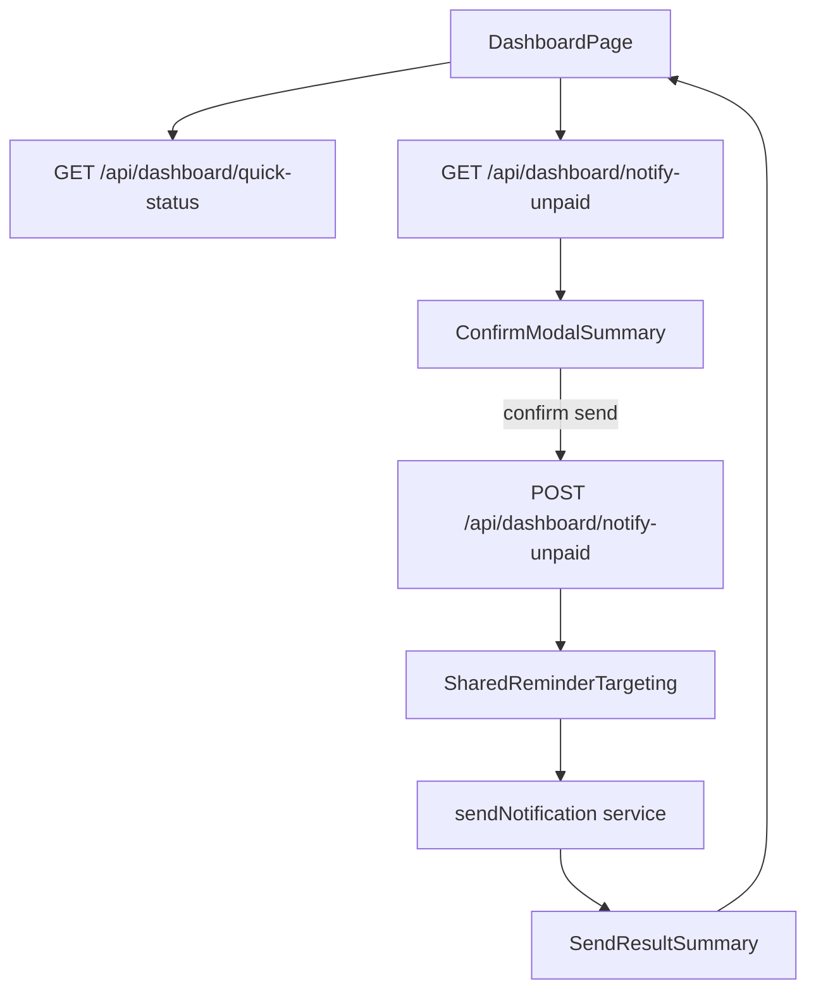

# Dashboard quick status + bulk unpaid notify

## Goal

Provide a dashboard-level operational view of payment status across admin-owned groups and add a safe bulk action that previews exactly who will be contacted (and who will be skipped) before sending reminders.

## Scope decisions locked

- Include only groups where current user is admin.
- “Notify all unpaid” targets only `pending` and `overdue` payments.
- Delivery channels are auto-resolved per recipient preferences.
- Email is always blocked when member has `unsubscribedFromEmail`.

## Implementation plan

### 1) Add dashboard bulk-reminder backend (preview + send)

- Create new authenticated admin-only route(s) under [src/app/api/dashboard/notify-unpaid/route.ts](/Users/nassos/Developer/subs-track/src/app/api/dashboard/notify-unpaid/route.ts).
- Support two operations:
  - `GET` preview summary (dry-run):
    - counts by group, payment, and channel eligibility
    - skip reasons (unsubscribed email, user email pref off, telegram pref off, missing telegram link, no reachable channel)
  - `POST` execute send:
    - re-run eligibility server-side (no trusting client preview)
    - send reminders for eligible pending/overdue payments only
    - return send result summary with success/failure/skipped breakdown
- Reuse existing reminder composition and channel behavior from [src/jobs/send-reminders.ts](/Users/nassos/Developer/subs-track/src/jobs/send-reminders.ts) and [src/lib/notifications/service.ts](/Users/nassos/Developer/subs-track/src/lib/notifications/service.ts), extracting shared helper(s) into `src/lib/notifications/reminder-targeting.ts` (or similar) to avoid logic drift between cron and manual send.

### 2) Add dashboard quick status data API

- Create [src/app/api/dashboard/quick-status/route.ts](/Users/nassos/Developer/subs-track/src/app/api/dashboard/quick-status/route.ts) to aggregate admin-owned groups only.
- Return compact stats for dashboard cards:
  - total admin groups
  - groups with pending/overdue
  - payment counts (`pending`, `overdue`, optional `member_confirmed` as read-only visibility)
  - recipient eligibility totals (email-eligible, telegram-eligible, unreachable)
- Keep response in existing API format conventions (`{ data: ... }` / `{ error: ... }`).

### 3) Build dashboard UI section for “all groups quick status”

- Add feature component(s):
  - [src/components/features/dashboard/all-groups-quick-status.tsx](/Users/nassos/Developer/subs-track/src/components/features/dashboard/all-groups-quick-status.tsx)
  - [src/components/features/dashboard/notify-unpaid-button.tsx](/Users/nassos/Developer/subs-track/src/components/features/dashboard/notify-unpaid-button.tsx)
- Integrate into [src/app/(dashboard)/dashboard/page.tsx](/Users/nassos/Developer/subs-track/src/app/(dashboard)/dashboard/page.tsx), near the current “Workspace pulse” area.
- Show at-a-glance status chips/cards and one primary action button: `Notify all unpaid`.

### 4) Implement confirmation modal with explicit handling

- Reuse dialog patterns from [src/components/features/groups/initialize-notify-button.tsx](/Users/nassos/Developer/subs-track/src/components/features/groups/initialize-notify-button.tsx).
- Modal content from preview API should clearly show:
  - what will be sent (total reminders, by channel, by group)
  - what will be skipped and why (with reason counts)
  - explicit note that unsubscribed members will not receive email
- Confirm action calls send API; then display a result state (sent, failed, skipped) and refresh dashboard data.
- Provide resilient UX:
  - disabled confirm while loading
  - clear error fallback
  - stale preview protection (server recomputes on send and returns effective totals)

### 5) Keep cron and manual behavior consistent

- Refactor `send-reminders` internals only as needed to share a single eligibility ruleset and reduce divergence.
- Preserve current cron semantics (grace-period filtering for cron job), while manual dashboard send can explicitly define whether grace-period is applied or bypassed; default recommendation: bypass grace period for manual send-now action and label this in modal.

### 6) Validation + release hygiene

- Run typecheck/lint on edited files and resolve any introduced issues.
- Add/update tests around eligibility classification and skip-reason accounting (unit-level around helper(s) + API response shape checks where feasible).
- Because this is a user-visible new capability, plan a **minor** version bump and changelog entry after implementation per workspace release rules.

## Data flow

## Key risks to handle

- Duplicate logic between cron/manual reminder paths causing inconsistent recipient selection.
- Ambiguity between “eligible by prefs” vs “actually reachable” recipients.
- Drift between preview counts and send-time counts if state changes; must recompute server-side on send.

