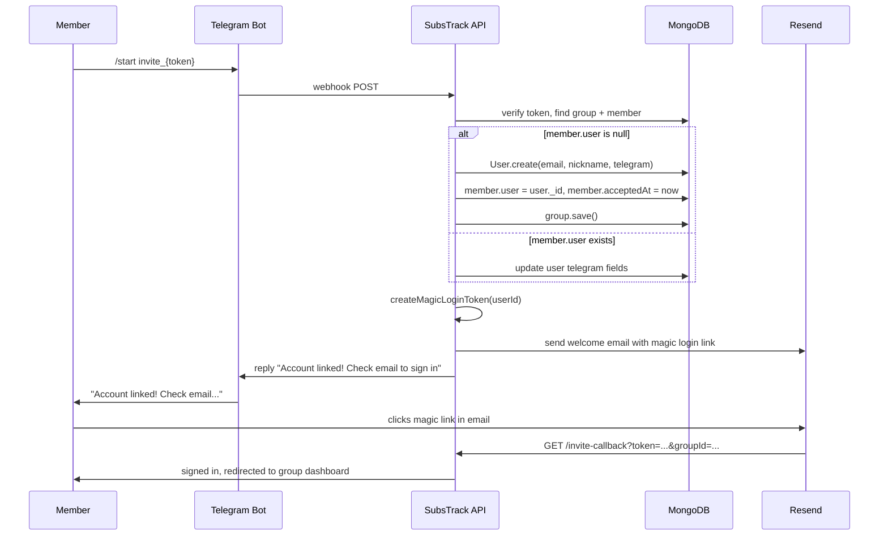

# Fix Invite Accept 500 and Telegram Bot Integration

## Root Cause Analysis

Two likely root causes affect both issues:

1. `**decryptValue` in settings service throws on crypto errors** — If `NEXTAUTH_SECRET` changed between when settings were encrypted and now, `decipher.final()` throws an unrecoverable error. This cascades into every code path that reads encrypted settings (confirmation secrets, Telegram tokens, webhook secrets).
2. **No try-catch in the invite accept route** — Any error during token verification, user creation, or magic token generation crashes the handler with HTTP 500.
3. **Telegram webhook likely never registered or failing silently** — The webhook endpoint itself may be returning 500 on every update due to the same decryption error, causing Telegram to stop delivering updates.

## Changes

### 1. Harden `decryptValue` in settings service

**File**: [src/lib/settings/service.ts](src/lib/settings/service.ts) (lines 38-65)

Wrap the crypto operations in a try-catch. If decryption fails (key mismatch, corrupt data), log a warning and return `null` instead of crashing the process:

```typescript
function decryptValue(value: string | null) {
  if (!value) return null;
  if (!value.startsWith("enc:")) return value;

  const [, iv, tag, encrypted] = value.split(":");
  if (!iv || !tag || !encrypted) return value;

  try {
    const decipher = crypto.createDecipheriv(
      "aes-256-gcm",
      getEncryptionKey(),
      Buffer.from(iv, "base64url")
    );
    decipher.setAuthTag(Buffer.from(tag, "base64url"));
    const decrypted = Buffer.concat([
      decipher.update(Buffer.from(encrypted, "base64url")),
      decipher.final(),
    ]);
    return decrypted.toString("utf8");
  } catch (err) {
    console.error(`failed to decrypt setting (key may have changed):`, err);
    return null;
  }
}
```

This single change prevents cascading 500s across the invite accept route, Telegram webhook, and every other route that reads encrypted settings.

### 2. Add try-catch to invite accept route

**File**: [src/app/api/invite/accept/[token]/route.ts](src/app/api/invite/accept/[token]/route.ts) (lines 36-111)

Wrap the entire `GET` handler body in a try-catch that returns an HTML error page with a link to the dashboard, instead of a raw 500.

### 3. Improve Telegram webhook resilience

**File**: [src/app/api/telegram/webhook/route.ts](src/app/api/telegram/webhook/route.ts)

- Wrap `getSetting` calls in the webhook route with additional error handling
- Add more specific error logging to help diagnose webhook failures

### 4. Add webhook diagnostics endpoint

**File**: new route `src/app/api/telegram/webhook-info/route.ts`

Add a `GET` endpoint (auth-protected) that calls `getWebhookInfo` from the Telegram Bot API and returns the result. This lets the admin verify the webhook is registered, check the URL, see pending update count, and see last error info — all from the settings page.

### 5. Enhance Telegram invite link to auto-create users + send welcome email

**File**: [src/lib/telegram/handlers.ts](src/lib/telegram/handlers.ts) (lines 248-313, `handleInviteLink`)

When `member.user` is null, instead of telling them to register manually:

1. Create a new `User` from `member.email` and `member.nickname` (same as invite accept route)
2. Set `telegram.chatId`, `telegram.username`, `telegram.linkedAt` on the new user
3. Link `member.user = user._id` and set `member.acceptedAt`
4. Save the group
5. Generate a magic login token (`createMagicLoginToken`)
6. Build a welcome email (reusing the invite template style) with the magic login link as the primary CTA, so the member can sign into the web dashboard
7. Send the email via `sendNotification`
8. Reply via Telegram: "Account linked! Check your email for a link to sign into the dashboard."

When `member.user` exists but Telegram is not yet linked, the existing code already handles this correctly (updates the user's Telegram fields). In this case, also send a welcome email with a magic login link if the user hasn't logged in before (i.e., `hashedPassword` is null and no prior session).

### 5b. Welcome email template for Telegram-joined members

**File**: new function in [src/lib/email/templates/group-invite.ts](src/lib/email/templates/group-invite.ts)

Add `buildTelegramWelcomeEmailHtml(params)` — reuses the same styled layout as the invite email but with different copy:

- Header: "Welcome to {groupName}"
- Body: "You've joined via Telegram. Use the link below to sign into the dashboard."
- Primary CTA button: "Sign into sub5tr4cker" → points to `/invite-callback?token={magic}&groupId={groupId}`
- Still includes billing summary, payment info, and group details (same as invite email)
- The existing invite-callback page already handles magic-link sign-in and redirects to the group

This reuses the existing `GroupInviteTemplateParams` interface (the `acceptInviteUrl` field carries the magic login callback URL instead of the invite accept URL).

### 6. Surface webhook diagnostics in settings UI

**File**: [src/components/features/settings/settings-page-client.tsx](src/components/features/settings/settings-page-client.tsx)

Add a "Check webhook status" button next to "Register webhook" that calls the new diagnostics endpoint and displays the webhook URL, last error date/message, and pending update count.

## Flow Diagram



## Version Bump

This is a minor bump (new Telegram invite auto-onboarding flow) plus bug fixes: `x.y.z` -> `x.(y+1).0`.