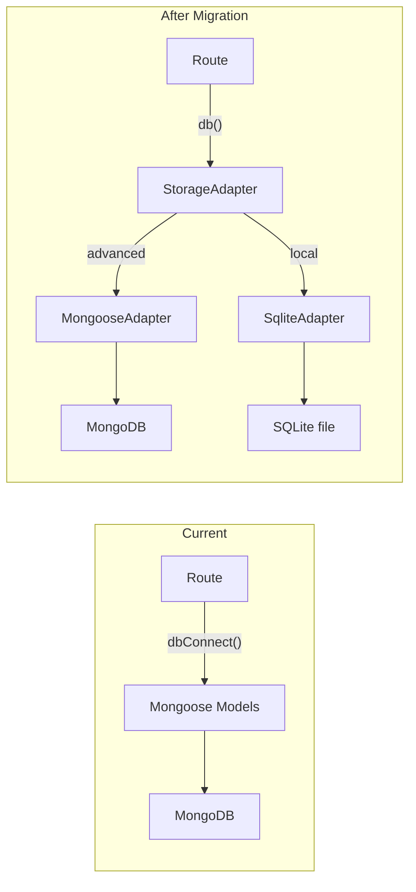

# Full SQLite Migration

## Problem

Both `SqliteAdapter` and `MongooseAdapter` fully implement the `StorageAdapter` interface, but nothing in the web app uses it. All 40 API routes, 8 lib modules, and 4 jobs call `dbConnect()` + Mongoose models directly. Local mode crashes because there's no `MONGODB_URI`.

## Strategy

Replace `dbConnect()` + `Model.method()` with `db()` + `adapter.method()` across the codebase. Each migration is backward-compatible because `MongooseAdapter` wraps the same Mongoose calls internally -- advanced mode keeps working identically.




## Migration pattern per route

Every route currently does:

```typescript
import { dbConnect } from "@/lib/db/mongoose";
import { Group, BillingPeriod } from "@/models";

await dbConnect();
const groups = await Group.find({ admin: userId }).lean();
```

After migration:

```typescript
import { db } from "@/lib/storage";

const store = await db();
const groups = await store.listGroupsForUser(userId, email);
```

Response shapes: map `group.id` to `_id` in JSON responses for frontend compat (the adapter uses `id`, the frontend expects `_id`).

## Cross-cutting issues to solve first

- `**mongoose.isValidObjectId()` guards** -- 23 route files use this to reject bad IDs. SQLite uses nanoid, not ObjectId. Replace with a generic `isNonEmptyString` check or remove entirely (adapter returns `null` for missing IDs, routes already handle that).
- `**logAudit()`** -- uses `AuditEvent` Mongoose model. Not in the adapter. Options: (a) add `logAudit` to adapter, (b) make it a no-op in local mode, (c) log to console. Recommend (a) with a simple `audit_events` SQLite table.
- `**billing-snapshot.ts`** -- `buildOpenOutstandingPeriodsQuery()` builds a Mongo-specific query object. Replace with `adapter.getOpenBillingPeriods()` which handles the query internally. The `aggregateOutstandingByGroupFromPeriods()` and `buildAdminBillingSnapshot()` functions are pure in-memory logic and work unchanged.

---

## Phase 0: Infrastructure

Create a `db()` helper that returns an initialized adapter, replacing `dbConnect()` as the universal entry point.

- **[src/lib/storage/index.ts](src/lib/storage/index.ts)**: add `export async function db(): Promise<StorageAdapter>` that calls `getAdapter()` + `initialize()` with idempotency guard
- **[src/lib/storage/sqlite-adapter.ts](src/lib/storage/sqlite-adapter.ts)**: make `initialize()` idempotent (skip if already opened)
- Add audit support to adapter: `logAudit(params)` method on `StorageAdapter`, implemented in both adapters
- Create a shared ID validator to replace `mongoose.isValidObjectId()` checks
- Add `_id` mapping to a small utility: `toApiId(storageObj)` that maps `id` -> `_id` for JSON responses

## Phase 1: Supporting libs

Migrate the library modules that multiple routes depend on. Each lib is small and self-contained.

- **[src/lib/audit.ts](src/lib/audit.ts)** -- replace `AuditEvent.create()` with `adapter.logAudit()`
- **[src/lib/billing/periods.ts](src/lib/billing/periods.ts)** -- replace `BillingPeriod.findOne/create/save` with adapter calls; change input from Mongoose `Group` document to `StorageGroup`
- **[src/lib/billing/backfill.ts](src/lib/billing/backfill.ts)** -- replace `BillingPeriod.find/save` with adapter; change Mongoose types to storage types
- **[src/lib/billing/calculator.ts](src/lib/billing/calculator.ts)** -- type-only change: swap `IGroup`/`IGroupMember` imports for storage types
- **[src/lib/notifications/service.ts](src/lib/notifications/service.ts)** -- replace `dbConnect()` + `User.findById` + `Notification.create` with adapter calls. This is the largest lib migration (~6 functions)
- **[src/lib/tasks/worker.ts](src/lib/tasks/worker.ts)** and **[src/lib/tasks/queue.ts](src/lib/tasks/queue.ts)** -- replace `ScheduledTask` + `Group.findById` + `BillingPeriod.findById` with adapter calls
- **[src/lib/settings/service.ts](src/lib/settings/service.ts)** -- make `getAllSettings()` local-mode-aware (derive from config file, matching existing `getSetting()` pattern)
- **[src/lib/dashboard/billing-snapshot.ts](src/lib/dashboard/billing-snapshot.ts)** -- replace `buildOpenOutstandingPeriodsQuery()` with a function that calls `adapter.getOpenBillingPeriods()`. The aggregation helpers are pure and stay unchanged.

## Phase 2: Core dashboard routes (dashboard loads)

These fire on every page load; migrating them makes the dashboard functional.

- `**GET /api/groups`** -- [src/app/api/groups/route.ts](src/app/api/groups/route.ts) (GET handler)
- `**GET /api/dashboard/quick-status`** -- [src/app/api/dashboard/quick-status/route.ts](src/app/api/dashboard/quick-status/route.ts)

## Phase 3: Group CRUD

- `**POST /api/groups**` -- [src/app/api/groups/route.ts](src/app/api/groups/route.ts) (POST handler)
- `**GET/PATCH/DELETE /api/groups/[groupId]**` -- [src/app/api/groups/[groupId]/route.ts](src/app/api/groups/[groupId]/route.ts)
- `**PATCH /api/groups/[groupId]/notifications**` -- [src/app/api/groups/[groupId]/notifications/route.ts](src/app/api/groups/[groupId]/notifications/route.ts)
- `**POST/GET /api/groups/[groupId]/invite-link**` -- [src/app/api/groups/[groupId]/invite-link/route.ts](src/app/api/groups/[groupId]/invite-link/route.ts)
- `**POST /api/groups/[groupId]/initialize**` -- [src/app/api/groups/[groupId]/initialize/route.ts](src/app/api/groups/[groupId]/initialize/route.ts)

## Phase 4: Members

- `**POST /api/groups/[groupId]/members**` -- [src/app/api/groups/[groupId]/members/route.ts](src/app/api/groups/[groupId]/members/route.ts)
- `**PATCH/DELETE /api/groups/[groupId]/members/[memberId]**` -- [src/app/api/groups/[groupId]/members/[memberId]/route.ts](src/app/api/groups/[groupId]/members/[memberId]/route.ts)
- **Send invite** -- [src/app/api/groups/[groupId]/members/[memberId]/send-invite/route.ts](src/app/api/groups/[groupId]/members/[memberId]/send-invite/route.ts)
- **Notify member added** -- [src/app/api/groups/[groupId]/notify-member-added/route.ts](src/app/api/groups/[groupId]/notify-member-added/route.ts)
- **Messages** -- [src/app/api/groups/[groupId]/messages/route.ts](src/app/api/groups/[groupId]/messages/route.ts)

## Phase 5: Billing

- `**GET/POST /api/groups/[groupId]/billing`** -- [src/app/api/groups/[groupId]/billing/route.ts](src/app/api/groups/[groupId]/billing/route.ts)
- `**GET/PATCH/DELETE .../billing/[periodId]`** -- [src/app/api/groups/[groupId]/billing/[periodId]/route.ts](src/app/api/groups/[groupId]/billing/[periodId]/route.ts)
- **Confirm / self-confirm / recalculate** -- confirm, self-confirm, recalculate routes
- **Advance / backfill / import / reconcile** -- remaining billing routes
- `**GET/POST /api/payments`** -- [src/app/api/payments/route.ts](src/app/api/payments/route.ts)
- **Confirm token** -- [src/app/api/confirm/[token]/route.ts](src/app/api/confirm/[token]/route.ts)
- **Dashboard notify-unpaid** -- [src/app/api/dashboard/notify-unpaid/route.ts](src/app/api/dashboard/notify-unpaid/route.ts)

## Phase 6: Jobs (cron)

- **[src/jobs/check-billing-periods.ts](src/jobs/check-billing-periods.ts)** -- replace Group queries with adapter
- **[src/jobs/enqueue-reminders.ts](src/jobs/enqueue-reminders.ts)** -- replace BillingPeriod/Group queries
- **[src/jobs/enqueue-follow-ups.ts](src/jobs/enqueue-follow-ups.ts)** -- same pattern
- **[src/jobs/reconcile-overdue.ts](src/jobs/reconcile-overdue.ts)** -- same pattern
- Runner and orchestrator files (`runner.ts`, `send-follow-ups.ts`, `run-notification-tasks.ts`) need no changes -- they delegate to the migrated code.

## Phase 7: Remaining routes

- **User**: register, profile, change-password, telegram/link
- **Settings**: settings route, test-email, test-telegram
- **Activity**: activity route, notification email rebuild
- **Scheduled tasks**: list, cancel/retry, bulk-cancel
- **Notifications**: delivery log, templates
- **Invite/join**: invite accept, invite code lookup, group join
- **Unsubscribe**: unsubscribe token route
- **Member portal**: member telegram-link
- **Notification preview**: group notification-preview

## Phase 8: Cleanup and verification

- Remove `dbConnect()` calls from all migrated files (should be zero remaining in routes/libs/jobs)
- Verify `import ... from "@/models"` only remains in MongooseAdapter and model definition files
- Run full test suite against both adapters
- Build standalone, test `s54r init` -> `s54r start` end-to-end
- Update the API routes cursor rule (`api-routes.mdc`) to reflect the new `db()` pattern

## Scope estimate

- **~40 route files** to migrate (mechanical: replace `dbConnect()` + Model calls with adapter)
- **~8 lib files** to migrate (notifications/service is the largest)
- **~4 job files** to migrate
- **~2 new adapter methods** (audit, possibly getTask by ID)
- **~1 new utility** (ID validation replacement)

Each file follows the same pattern. After the first 5-6 are done the rest are highly repetitive.