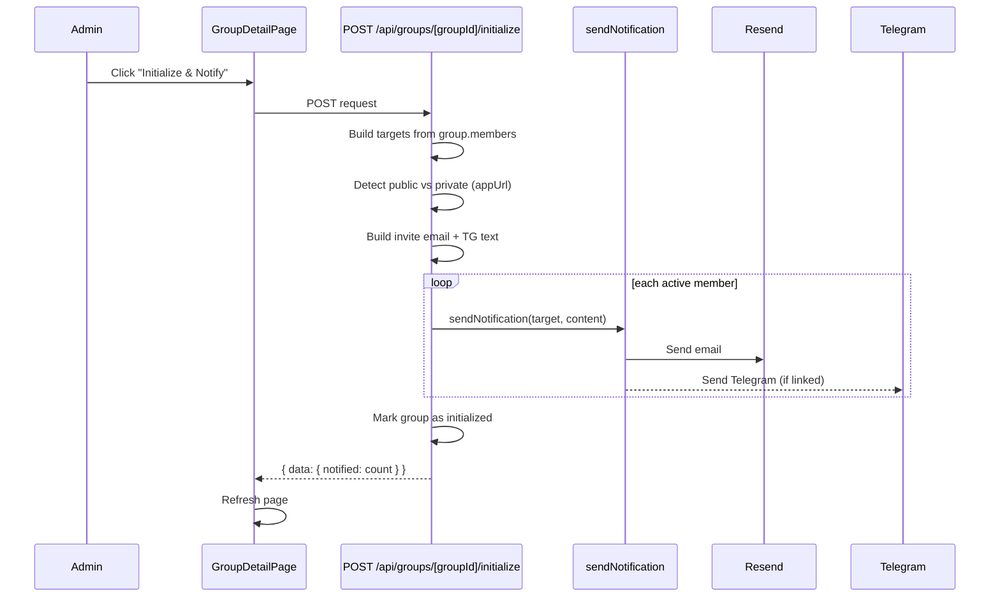
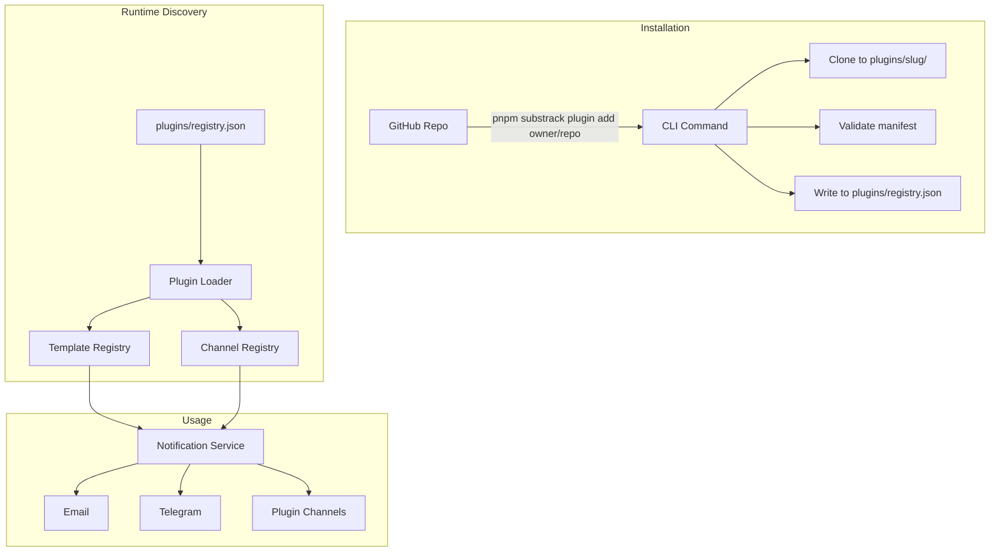

# Initialize & Notify Group + Plugin System

## Part 1: Initialize & Notify Group

### What it does

Admin clicks "Initialize & Notify" on a group detail page. Every active member receives a welcome/invite notification via email (and Telegram if linked). The email content adapts based on two factors:

- **Public app** (`general.appUrl` is a real URL, not localhost) — members get a link to log in, view the group, see billing history, confirm payments, and link their Telegram.
- **Private app** (no public URL) — members get a simpler email with group details, the admin's reply-to email, payment instructions, and Telegram bot setup instructions.

Group-level config also shapes the email: payment platform, payment link, billing mode, cycle info.

### Data flow




### Files to create / modify

- **New template**: `src/lib/email/templates/group-invite.ts` — `buildGroupInviteEmailHtml(params)` and `buildGroupInviteTelegramText(params)`. The params include `isPublic`, `appUrl`, `groupName`, `serviceName`, `memberName`, `adminName`, `billingSummary`, `paymentPlatform`, `paymentLink`, `paymentInstructions`, `telegramBotUsername`. The HTML builder branches on `isPublic` to render different CTAs and content sections.
- **Register template**: Update `src/lib/email/templates/index.ts` — add `"invite"` to `NotificationTemplateType`, add its preview case.
- **New API route**: `src/app/api/groups/[groupId]/initialize/route.ts` — POST handler that:
  1. Checks auth + admin ownership
  2. Loads group + resolves member User records (for Telegram chatIds and prefs)
  3. Reads `general.appUrl` via `getSetting` to determine public vs private
  4. Builds invite content using the template
  5. Calls `sendNotification` for each active member
  6. Sets `group.initializedAt = new Date()` and saves (prevents accidental re-send; UI can show warning if already initialized)
- **Schema update**: Add `initializedAt: Date | null` field to the Group model in `src/models/group.ts`
- **UI**: Add an "Initialize & Notify Group" button on the group detail page (`src/app/(dashboard)/dashboard/groups/[groupId]/page.tsx`) that appears when `group.role === "admin"`. Shows a confirmation dialog before sending. If `initializedAt` is set, show "Re-notify" with a warning instead.

### Email content (public vs private)

**Public mode** (appUrl is a real hostname):

- Header: "You've been added to {groupName}"
- Body: group details (service, price, cycle, billing mode), payment instructions
- CTA buttons: "View Group" (link to `/dashboard/groups/{id}`), "Set Up Telegram" (link to bot)
- Footer: "Manage your notifications at {appUrl}/dashboard/settings"

**Private mode** (no public URL or localhost):

- Header: "You've been added to {groupName}"
- Body: same group details, payment instructions
- Reply instructions: "Reply to this email or contact {adminName} for questions"
- Telegram section: "Get updates via Telegram — start a chat with @{botUsername} and send /start"
- No app links (since there's no public URL to link to)

---

## Part 2: Plugin System (Templates + Channels)

### Architecture

Plugins are GitHub repos following a convention. They're installed into `plugins/` at the project root and discovered at startup.




### Plugin manifest format

Each plugin repo has a `substrack-plugin.json` at its root:

```json
{
  "name": "substrack-plugin-slack",
  "version": "1.0.0",
  "description": "Slack notification channel for SubsTrack",
  "author": "github-user",
  "provides": {
    "templates": ["slack-reminder"],
    "channels": ["slack"]
  },
  "templates": {
    "slack-reminder": {
      "file": "./templates/slack-reminder.js",
      "name": "Slack Payment Reminder",
      "description": "Payment reminder formatted for Slack blocks"
    }
  },
  "channels": {
    "slack": {
      "file": "./channels/slack.js",
      "name": "Slack",
      "configSchema": {
        "webhookUrl": { "type": "string", "required": true, "label": "Webhook URL" }
      }
    }
  }
}
```

### Plugin interfaces

Plugins export plain JS/TS modules. Two interfaces:

**Template plugin** — exports `buildMessage(params): { subject, html, text }` + `sampleParams` + `metadata` (name, description, variables). Must follow the same pattern as existing templates in [src/lib/email/templates/payment-reminder.ts](src/lib/email/templates/payment-reminder.ts).

**Channel plugin** — exports `send(config, message): Promise<{ sent, externalId? }>` + `metadata` (name, configSchema). The `config` object holds user-provided settings (e.g. Slack webhook URL); `message` holds `{ subject, text, html }`.

### Files to create / modify

- **Plugin loader**: `src/lib/plugins/loader.ts` — reads `plugins/registry.json`, validates manifests, returns registered templates and channels
- **Plugin registry file**: `plugins/registry.json` — list of installed plugins with metadata (auto-managed by CLI)
- **Template registry**: `src/lib/plugins/templates.ts` — merges built-in templates with plugin templates into a unified registry. Replaces the static switch in [src/lib/email/templates/index.ts](src/lib/email/templates/index.ts)
- **Channel registry**: `src/lib/plugins/channels.ts` — merges built-in channels (email, telegram) with plugin channels. The notification service queries this registry instead of hardcoding `sendEmail` + `sendTelegramMessage`
- **CLI commands**: Add `plugin add <repo>`, `plugin remove <slug>`, `plugin list` to the existing CLI in `src/cli/` — `plugin add` clones the repo into `plugins/`, validates the manifest, writes to `registry.json`
- **Notification service refactor**: Update [src/lib/notifications/service.ts](src/lib/notifications/service.ts) to use the channel registry — loop over enabled channels for a target instead of hardcoding email + telegram
- **Settings**: Add per-plugin config storage — `src/lib/settings/definitions.ts` gets dynamically extended when plugins declare `configSchema` fields, stored under `plugin.<slug>.<key>` in the Settings model
- **Dashboard UI**: Add a "Plugins" section in the settings page to list installed plugins, show their status, and configure channel settings

### CLI installation flow

```bash
# install from github
pnpm substrack plugin add username/substrack-plugin-slack

# what happens:
# 1. git clone https://github.com/username/substrack-plugin-slack plugins/slack
# 2. validate plugins/slack/substrack-plugin.json
# 3. if manifest has dependencies, run pnpm install in the plugin dir
# 4. append entry to plugins/registry.json
# 5. print success message + next steps (configure via dashboard)
```

---

## Part 3: Future Idea (logged separately)

Log the **full plugin system** idea (billing modes, payment platforms, UI widgets, webhooks) via the idea-logger into `_future/full-plugin-system/`. This is out of scope for now but captured for future planning.

---

## Version bump

This is a **minor** bump (0.4.0 -> 0.5.0): new feature (initialize & notify), new infrastructure (plugin system), no breaking changes.