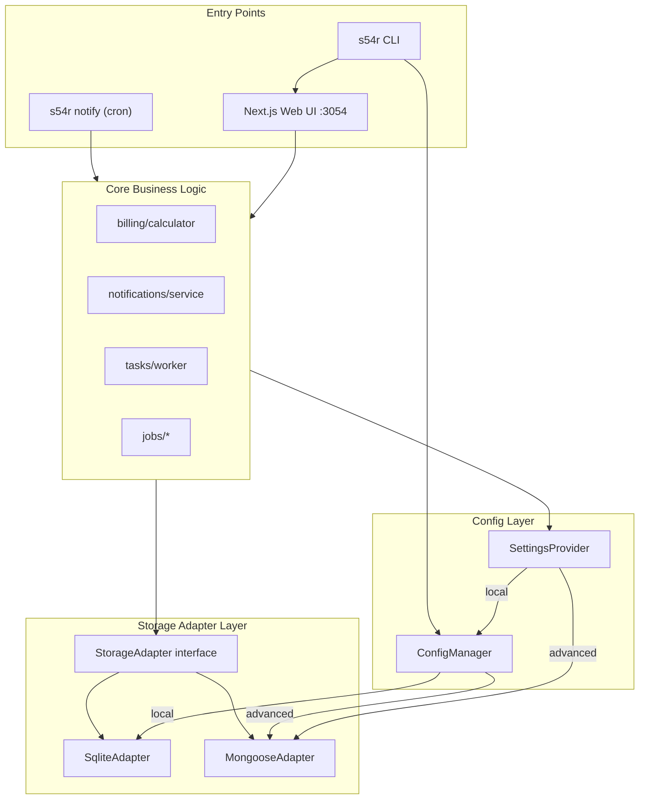
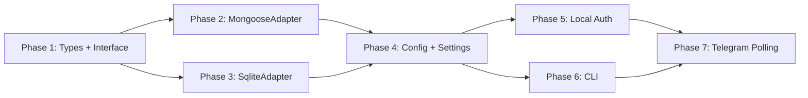

# sub5tr4cker: Minimal Local-First Mode

Full idea documentation: `[_future/minimal-local-mode/](_future/minimal-local-mode/README.md)`

## Current State

The codebase already has useful infrastructure to build on:

- **CLI**: `[src/cli/index.ts](src/cli/index.ts)` -- Commander + @clack/prompts, wizard steps for setup/configure/plugin
- **Channel abstraction**: `[src/lib/plugins/channels.ts](src/lib/plugins/channels.ts)` -- `NotificationChannel` interface with email + Telegram built-ins
- **Package**: `package.json` already has `name: "sub5tr4cker"`, bin entry (currently `substrack`, needs rename to `s54r`), port 3054 in dev script

Key coupling points that need decoupling:

- **40+ direct Mongoose calls** across API routes, jobs, billing lib, notification service, and task worker
- **Settings**: `[src/lib/settings/service.ts](src/lib/settings/service.ts)` -- all reads go through `dbConnect()` + `Settings.findOne()`
- **Auth**: `[src/lib/auth.ts](src/lib/auth.ts)` -- NextAuth v5 with `MongoDBAdapter`, session callback reloads User from MongoDB
- **Telegram**: webhook-only today (`[src/app/api/telegram/webhook/route.ts](src/app/api/telegram/webhook/route.ts)`); local mode needs polling

## Architecture




## Phase 1: Storage-Agnostic Types + Adapter Interface

Extract Mongoose-specific types into storage-agnostic domain types that both adapters will use.

**New files:**

- `src/lib/storage/types.ts` -- plain TypeScript interfaces for all entities (Group, BillingPeriod, etc.) without `Types.ObjectId`, `Document`, or Mongoose-specific fields. IDs are `string`. Dates are `Date`. Embedded arrays are plain arrays.
- `src/lib/storage/adapter.ts` -- the `StorageAdapter` interface

**Key operations the adapter must support** (derived from codebase analysis):

```typescript
interface StorageAdapter {
  // lifecycle
  initialize(): Promise<void>;
  close(): Promise<void>;

  // groups
  createGroup(data: CreateGroupInput): Promise<Group>;
  getGroup(id: string): Promise<Group | null>;
  getGroupWithMemberUsers(id: string): Promise<GroupWithUsers | null>;
  listGroupsForUser(userId: string, email: string): Promise<Group[]>;
  updateGroup(id: string, data: Partial<GroupInput>): Promise<Group>;
  softDeleteGroup(id: string): Promise<void>;
  findGroupByInviteCode(code: string): Promise<Group | null>;

  // billing periods
  createBillingPeriod(data: CreateBillingPeriodInput): Promise<BillingPeriod>;
  getBillingPeriod(id: string, groupId: string): Promise<BillingPeriod | null>;
  getOpenPeriods(filter: OpenPeriodsFilter): Promise<BillingPeriod[]>;
  getPeriodsForGroup(groupId: string, sort?: SortSpec): Promise<BillingPeriod[]>;
  updateBillingPeriod(id: string, data: Partial<BillingPeriodInput>): Promise<BillingPeriod>;
  deleteBillingPeriod(id: string, groupId: string): Promise<void>;

  // payments (embedded in billing periods)
  updatePaymentStatus(periodId: string, memberId: string, update: PaymentUpdate): Promise<void>;

  // notifications
  logNotification(data: CreateNotificationInput): Promise<void>;
  getNotifications(groupId: string, limit: number): Promise<Notification[]>;

  // scheduled tasks
  enqueueTask(data: CreateTaskInput): Promise<ScheduledTask>;
  claimTasks(limit: number): Promise<ScheduledTask[]>;
  completeTask(id: string): Promise<void>;
  failTask(id: string, error: string): Promise<void>;

  // users (in advanced mode; local mode returns a fixed admin user)
  getUser(id: string): Promise<User | null>;
  getUserByEmail(email: string): Promise<User | null>;

  // price history
  createPriceHistory(data: CreatePriceHistoryInput): Promise<void>;

  // data portability
  exportAll(): Promise<ExportBundle>;
  importAll(bundle: ExportBundle): Promise<ImportResult>;
}
```

**Refactoring approach**: define types first, then gradually replace Mongoose types in business logic files. The billing calculator (`[src/lib/billing/calculator.ts](src/lib/billing/calculator.ts)`) is already mostly pure -- it just needs its input types changed from `IGroup`/`IGroupMember` to the new domain types.

## Phase 2: MongooseAdapter (Wrap Existing Code)

Before building SQLite, wrap the existing Mongoose operations behind the adapter interface. This proves the interface works and is a safe refactor.

**New file:** `src/lib/storage/mongoose-adapter.ts`

This is a thin wrapper:

- Each method maps to the existing Mongoose model calls (`.find()`, `.findById()`, `.create()`, `.save()`, etc.)
- Converts between Mongoose documents and domain types (strip `_id` → `id`, convert `ObjectId` → `string`, etc.)
- Handles the `dbConnect()` call internally

**Key complexity**: the `getGroupWithMemberUsers` method needs to replicate the current `.populate("members.user")` pattern. The `claimTasks` method needs the optimistic locking (`findOneAndUpdate` with `status: "pending"` guard).

**New file:** `src/lib/storage/index.ts` -- adapter factory

```typescript
let adapter: StorageAdapter | null = null;

export function getAdapter(): StorageAdapter {
  if (!adapter) {
    const mode = getAppMode(); // reads config
    adapter = mode === 'local'
      ? new SqliteAdapter(getDataPath())
      : new MongooseAdapter();
  }
  return adapter;
}
```

**Incremental migration**: don't refactor all API routes at once. Start with one route file (e.g., `[src/app/api/groups/route.ts](src/app/api/groups/route.ts)`), replace direct Mongoose calls with `getAdapter()`, verify tests pass, then continue.

## Phase 3: SQLite Adapter

**New file:** `src/lib/storage/sqlite-adapter.ts`

**Dependency:** `better-sqlite3` (add to package.json)

**Schema design** -- tables with JSON data columns, extracted indexed fields:

```sql
CREATE TABLE groups (
  id TEXT PRIMARY KEY,
  admin_id TEXT NOT NULL,
  is_active INTEGER DEFAULT 1,
  invite_code TEXT UNIQUE,
  data JSON NOT NULL,
  created_at TEXT DEFAULT (datetime('now')),
  updated_at TEXT DEFAULT (datetime('now'))
);

CREATE TABLE billing_periods (
  id TEXT PRIMARY KEY,
  group_id TEXT NOT NULL REFERENCES groups(id),
  period_start TEXT NOT NULL,
  collection_opens_at TEXT,
  is_fully_paid INTEGER DEFAULT 0,
  data JSON NOT NULL,
  created_at TEXT DEFAULT (datetime('now')),
  updated_at TEXT DEFAULT (datetime('now'))
);

CREATE TABLE scheduled_tasks (
  id TEXT PRIMARY KEY,
  type TEXT NOT NULL,
  status TEXT DEFAULT 'pending',
  run_at TEXT NOT NULL,
  idempotency_key TEXT UNIQUE,
  data JSON NOT NULL,
  locked_at TEXT,
  created_at TEXT DEFAULT (datetime('now'))
);
```

IDs generated via `nanoid`. The `data` JSON column stores the full document. Extracted columns (`admin_id`, `is_active`, `group_id`, `is_fully_paid`, etc.) enable efficient queries that the current Mongoose code uses (`$expr`, compound filters).

**Critical query to port**: the collection window filter from `[src/lib/billing/collection-window.ts](src/lib/billing/collection-window.ts)` uses `$expr`/`$ifNull` MongoDB operators. The SQLite equivalent uses `COALESCE(collection_opens_at, period_start)` and date comparisons.

**Testing strategy**: write adapter conformance tests once (in `src/lib/storage/__tests__/adapter-conformance.test.ts`), run the same suite against both `MongooseAdapter` and `SqliteAdapter`.

## Phase 4: Config Manager + Settings Provider

**New file:** `src/lib/config/manager.ts`

In local mode, settings come from `~/.sub5tr4cker/config.json` instead of MongoDB. The config manager:

- Reads/writes `~/.sub5tr4cker/config.json`
- Validates with Zod
- Provides the same `getSetting(key)` / `setSetting(key, value)` API

**Refactor:** `[src/lib/settings/service.ts](src/lib/settings/service.ts)` -- add a mode check at the top of `getSetting()`:

```typescript
export async function getSetting(key: string): Promise<string | null> {
  if (getAppMode() === 'local') {
    return getLocalSetting(key); // reads from config.json
  }
  // existing MongoDB path...
}
```

This is the smallest change that decouples settings from MongoDB. The existing settings definitions (`[src/lib/settings/definitions.ts](src/lib/settings/definitions.ts)`) and categories still work -- they just read from a different backing store.

## Phase 5: Local Auth

**Modify:** `[src/lib/auth.ts](src/lib/auth.ts)`

In local mode, `auth()` should return a fixed session with a synthetic admin user instead of checking NextAuth/MongoDB:

```typescript
export async function getLocalSession(): Promise<Session> {
  return {
    user: {
      id: 'local-admin',
      email: getLocalConfig().adminEmail || 'admin@localhost',
      name: 'Admin',
      role: 'admin',
    },
    expires: new Date(Date.now() + 30 * 24 * 60 * 60 * 1000).toISOString(),
  };
}
```

**New file:** `src/lib/auth/local.ts` -- local auth helpers (token generation, cookie validation)

**Modify:** `[src/middleware.ts](src/middleware.ts)` -- in local mode, validate the token cookie from config. If missing/invalid on dashboard routes, set it from config and redirect.

API routes currently call `auth()` and check `session?.user?.id`. The local auth wrapper returns a session where `user.id` is always `'local-admin'`. The adapter's user methods return a synthetic user object for this ID.

## Phase 6: CLI Enhancements

**Modify:** `[src/cli/index.ts](src/cli/index.ts)` -- rename bin from `substrack` to `s54r`, add new commands:

- `s54r init` -- local-mode wizard (reuses existing wizard infrastructure but writes to `~/.sub5tr4cker/config.json` instead of `.env.local` + MongoDB)
- `s54r start` -- runs `next start --port 3054`, opens browser
- `s54r notify` -- standalone notification script (imports core logic, runs against SQLite, exits)
- `s54r export` / `s54r import` -- calls adapter's `exportAll()` / `importAll()`
- `s54r migrate` -- export from SQLite, import to MongoDB, switch config mode
- `s54r cron-install` -- OS-aware cron/launchd setup with permission prompt
- `s54r uninstall` -- backup prompt, then cleanup

The existing `setup` and `configure` commands stay for advanced (MongoDB) mode.

**Data directory:** `~/.sub5tr4cker/` containing:

- `config.json` -- mode, notification settings, auth token, cron state
- `data.db` -- SQLite database
- `logs/` -- notification logs (optional)

## Phase 7: Telegram Polling Mode

**Modify:** `[src/lib/telegram/bot.ts](src/lib/telegram/bot.ts)`

Add a polling mode for local use. grammy supports `bot.start()` for long-polling out of the box. For the `s54r notify` cron script, use a one-shot `getUpdates` call:

```typescript
export async function pollOnce(bot: Bot): Promise<void> {
  const config = getLocalConfig();
  const offset = config.telegramLastUpdateId
    ? config.telegramLastUpdateId + 1
    : undefined;

  const updates = await bot.api.getUpdates({ offset, timeout: 0 });
  for (const update of updates) {
    await bot.handleUpdate(update);
  }

  if (updates.length > 0) {
    const lastId = updates[updates.length - 1].update_id;
    await updateLocalConfig({ telegramLastUpdateId: lastId });
  }
}
```

The `s54r notify` script calls `pollOnce()` at the start of each run, processes any "I paid" callbacks, then sends due reminders.

## Implementation Order

The phases are ordered by dependency and risk:




Phase 1 is pure additive (new types, no refactoring). Phase 2 wraps existing code (safe refactor, no behavior change). Phase 3 is independent new code (testable in isolation). Phases 4-7 wire everything together.

## Key Risk: Collection Window Query

The hardest single piece is porting the collection window filter. Current MongoDB version in `[src/lib/billing/collection-window.ts](src/lib/billing/collection-window.ts)`:

```typescript
{ $expr: { $lte: [{ $ifNull: ["$collectionOpensAt", "$periodStart"] }, now] } }
```

SQLite equivalent:

```sql
WHERE COALESCE(collection_opens_at, period_start) <= datetime('now')
  AND is_fully_paid = 0
```

This should be validated early in Phase 3 with real test data.