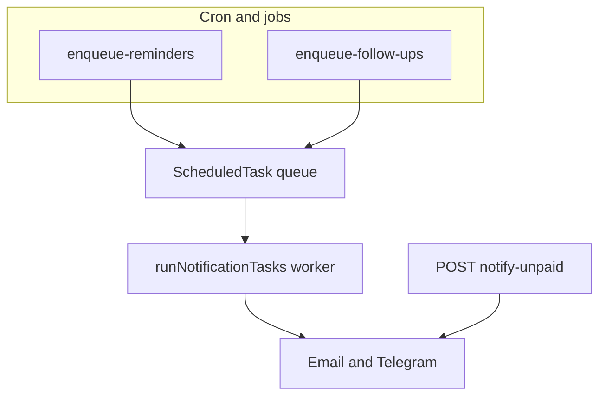

# SubsTrack — Architecture Plan

## Vision

SubsTrack is an open-source web application for managing shared subscriptions. One person (the **admin**) pays for a service like YouTube Premium Family, Netflix, or any recurring bill, and splits the cost with **members**. The app automates payment tracking, reminders, confirmations, and communication — replacing the manual Google Sheets + Apps Script approach.

## Progress Snapshot (2026-03-18)

- Phase 1 MVP checklist is implemented
- Core Phase 2 Telegram workflow is implemented (bot setup, account linking, payment confirmations, follow-ups)
- Remaining near-term roadmap items are price change announcements and member-to-admin requests

## Core Concepts

### Subscription Group

A **group** represents one shared subscription. It has:

- An **admin** — the person who pays the full price to the service provider
- **Members** — people who owe a share each billing period
- A **service** — the subscription being shared (YouTube Premium, Netflix, a utility bill, etc.)
- A **billing mode** — how the cost is split among members
- A **payment method** — how members pay the admin (Revolut link, bank transfer, Stripe, etc.)

### Billing Modes

| Mode | Description | Use case |
|------|-------------|----------|
| `equal_split` | Full price ÷ total members (admin optionally included) | YouTube Premium Family, Spotify Family |
| `fixed_amount` | Admin sets a fixed amount per member | When admin absorbs part of the cost |
| `variable` | Price changes every period (like a utility bill) | Shared electricity, water, internet |

### Payment Confirmation Flow

This is the key innovation over a static spreadsheet:

```
[Billing period starts]
    → Cron calculates each member's share
    → Sends reminder via email and/or Telegram
    → Member pays via payment link (Revolut, etc.)
    → Member confirms: clicks "I paid" in email or Telegram
    → Status: pending → member_confirmed
    → Admin receives notification: "User X says they paid for March"
    → Admin confirms in dashboard or via Telegram
    → Status: member_confirmed → confirmed
```

### Notification pipeline (queued vs manual)



Automatic reminders and admin follow-up nudges go through **ScheduledTask** + worker. The dashboard **Notify unpaid** action sends reminders **directly** (same templates, different pipeline) and updates period reminder metadata — see `docs/api-design.md` → Flows.

Statuses per member per period:
- `pending` — hasn't paid yet
- `member_confirmed` — member says they paid, awaiting admin verification
- `confirmed` — admin verified the payment
- `overdue` — past reminder threshold, not paid

### Invite & Onboarding Flow

Members don't need to create accounts to receive reminders (email-only mode). But for the full experience:

1. Admin creates a group and adds member emails
2. Members get an invite email with a magic link
3. Clicking the link creates their account (or links to existing)
4. Members can then connect Telegram, view history, confirm payments

## Tech Stack

| Layer | Technology | Rationale |
|-------|-----------|-----------|
| Framework | Next.js 15 (App Router) | SSR, API routes, server actions, modern React |
| Database | MongoDB + Mongoose | Flexible schema for subscription configs, self-hostable |
| Auth | Auth.js v5 (NextAuth) | Mature, App Router support, multiple providers |
| Email | Resend (default) + pluggable | Developer-friendly, React Email templates, free tier |
| Telegram | grammy | Same library as OpenClaw, battle-tested, good TypeScript support |
| Cron | node-cron (self-hosted) / HTTP-triggered (hosted) | Flexible deployment |
| UI | Tailwind CSS + shadcn/ui | Beautiful defaults, accessible, customizable |
| Validation | Zod | Runtime + TypeScript type inference |
| State | React Query (TanStack Query) | Cache, mutations, optimistic updates |

## Architecture Overview

```
┌─────────────────────────────────────────────────────────┐
│                     Next.js App                         │
│                                                         │
│  ┌──────────┐  ┌──────────────┐  ┌───────────────────┐  │
│  │  Pages/   │  │  API Routes  │  │  Server Actions   │  │
│  │  UI       │  │  /api/*      │  │                   │  │
│  └────┬─────┘  └──────┬───────┘  └────────┬──────────┘  │
│       │               │                   │              │
│       └───────────┬───┴───────────────────┘              │
│                   │                                      │
│  ┌────────────────▼─────────────────────────────────┐    │
│  │              Service Layer                        │    │
│  │  ┌──────────┐ ┌──────────┐ ┌───────────────────┐ │    │
│  │  │ Group    │ │ Billing  │ │ Notification      │ │    │
│  │  │ Service  │ │ Service  │ │ Service           │ │    │
│  │  └──────────┘ └──────────┘ └───────────────────┘ │    │
│  └──────────────────────────────────────────────────┘    │
│                   │                                      │
│  ┌────────────────▼─────────────────────────────────┐    │
│  │              Data Layer (Mongoose)                │    │
│  │  User | Group | BillingPeriod | PriceHistory |    │    │
│  │  Notification | PaymentConfirmation               │    │
│  └──────────────────────────────────────────────────┘    │
│                   │                                      │
└───────────────────┼──────────────────────────────────────┘
                    │
        ┌───────────┼────────────┐
        │           │            │
   ┌────▼───┐ ┌────▼────┐ ┌────▼─────┐
   │MongoDB │ │ Resend  │ │ Telegram │
   │        │ │ (email) │ │ (grammy) │
   └────────┘ └─────────┘ └──────────┘
```

## Notification Channels

### Email

- Default channel, works without user accounts
- Payment reminders with breakdown and "I paid" link
- "I paid" link hits `/api/confirm/[token]` which marks the period as `member_confirmed`
- Token is a signed JWT or HMAC to prevent spoofing
- Email templates built with React Email for maintainability

### Telegram

Inspired by OpenClaw's grammy integration:

- **Bot setup**: grammy with polling (simple) or webhook (production)
- **User linking**: User provides their Telegram username or starts a chat with the bot → bot receives chat ID → linked to their account
- **Reminders**: Sent as Telegram messages with inline keyboard buttons (**I've Paid**, **Remind later**, **Show paying details** — details reply uses group payment settings)
- **"I paid" button**: Inline keyboard callback → marks as `member_confirmed`
- **Admin notifications**: Bot sends message to admin when member confirms
- **Admin confirmation**: Inline keyboard "Confirm" / "Reject" buttons

```
Member receives Telegram message:
┌─────────────────────────────────────┐
│ 💳 Payment Reminder                 │
│                                     │
│ YouTube Premium — March 2026        │
│ Your share: €4.00                   │
│                                     │
│ Pay via: (payment link)             │
│                                     │
│ [   I've Paid   ] [  Remind Later  ]│
│ [      Show paying details         ]│
└─────────────────────────────────────┘

Admin receives after member confirms:
┌─────────────────────────────────────┐
│ ✓ Payment Confirmation              │
│                                     │
│ vasiliki says they paid €4.00       │
│ for YouTube Premium — March 2026    │
│                                     │
│ [  Confirm  ] [  Reject  ]          │
└─────────────────────────────────────┘
```

### Future: Telegram Group Mode

Admin can optionally create a Telegram group where:
- Bot posts monthly summaries
- Members can confirm in-group
- Transparency mode: everyone sees who has/hasn't paid

This is optional and separate from DM-based notifications.

## Cron Job Design

Notification delivery uses a **persisted task queue**: cron jobs enqueue work into the `ScheduledTask` collection, and a worker (run frequently) claims and executes due tasks. Reconciliation jobs (billing period creation, overdue state) still run inline on a schedule.

### Architecture

- **Producers** — Cron (or one-off triggers) scan business state and enqueue tasks with an idempotency key so the same reminder/nudge is not duplicated.
- **Task store** — `ScheduledTask` documents with `status` (pending → locked → completed/failed), `runAt`, `lockedAt`/`lockedBy`, retry metadata.
- **Worker** — Claims due tasks in batches, executes each via the notification service, then marks completed or fails with backoff.

### Self-hosted mode

A separate Node.js process runs `node-cron`:

```
jobs/
├── check-billing-periods.ts      # create new billing periods when due (reconciliation)
├── enqueue-reminders.ts         # enqueue payment_reminder tasks for unpaid periods
├── enqueue-follow-ups.ts        # enqueue admin_confirmation_request tasks
├── reconcile-overdue.ts         # mark pending → overdue after 14 days
├── send-follow-ups.ts          # reconcile overdue + enqueue admin nudges
├── run-notification-tasks.ts   # worker: claim and execute due tasks
└── runner.ts                    # node-cron scheduler entry point
```

### Hosted mode (Vercel, Railway, etc.)

- Expose `/api/cron/[job]` routes protected by `x-cron-secret` (app setting `security.cronSecret`).
- External scheduler hits these endpoints. Call **notification-tasks** frequently (e.g. every 5 min) to process the queue.

### Job Schedule

| Trigger | Schedule | Description |
|---------|----------|-------------|
| `check-billing-periods` | Daily at 00:00 | Creates new billing period entries when a subscription's billing date passes |
| `reminders` (cron) | Daily at 10:00 | Enqueues payment reminder tasks for unpaid payments past grace period, then runs worker |
| `follow-ups` (cron) | Every 3 days at 14:00 | Reconciles overdue state (pending → overdue), enqueues admin nudge tasks, then runs worker |
| `notification-tasks` | Every 5 minutes | Worker: claims due tasks, sends via notification service, updates task state |

### Notification task queue (operator notes)

- **Idempotency** — One task per business event per run window (e.g. per payment per day). Duplicate enqueue is a no-op.
- **Lock TTL** — Worker claims tasks with a 5-minute lock. Stale locks are recovered on the next run so stuck tasks are retried.
- **Retries** — Failed tasks are retried with exponential backoff (capped at 24 h) up to `maxAttempts` (default 5), then marked failed.
- **Observability** — `POST /api/cron/notification-tasks` response includes `counts` (pending, locked, completed, failed). Use for monitoring backlog.

## Payment Integration

### Phase 1: Payment Links (MVP)

Simple payment links — the admin provides a URL (Revolut, PayPal, bank transfer page) and it's included in reminders. No payment verification, relies on manual confirmation flow.

Supported platforms:
- Revolut (`revolut.me/...`)
- PayPal (`paypal.me/...`)
- Bank transfer (IBAN displayed)
- Custom link

### Phase 2: Stripe Integration (Future)

For groups that want automatic payment verification:
- Admin connects Stripe via OAuth
- Members pay through Stripe Checkout
- Webhook confirms payment automatically (no manual confirmation needed)
- Stripe Payment Links or Checkout Sessions per billing period

### Phase 3: Request.finance / Crypto (Future)

- Crypto-friendly payment requests
- On-chain payment verification

## User Roles & Permissions

| Action | Admin | Member | Guest (email-only) |
|--------|-------|--------|---------------------|
| Create group | ✓ | | |
| Edit group settings | ✓ | | |
| Add/remove members | ✓ | | |
| Change price | ✓ | | |
| View payment history | ✓ | ✓ (own) | |
| Confirm own payment | ✓ | ✓ | ✓ (via email link) |
| Verify member payments | ✓ | | |
| Send announcements | ✓ | | |
| Submit requests | | ✓ | |
| Connect Telegram | ✓ | ✓ | |

## Feature Roadmap

### Phase 1 — MVP

- [x] User auth (email + password, Google OAuth)
- [x] Create subscription groups
- [x] Add members by email
- [x] Monthly billing period tracking
- [x] Payment status tracking (pending / confirmed)
- [x] Email reminders with payment link and "I paid" confirmation
- [x] Admin dashboard: see all groups, payment statuses
- [x] Member view: see own subscriptions and payment history
- [x] Cron job for automated reminders

### Phase 2 — Telegram & Communication

- [x] Telegram bot setup (grammy, webhook mode)
- [x] Link Telegram account to user profile
- [x] Telegram payment reminders with inline buttons
- [x] Admin confirmation via Telegram
- [ ] Price change announcements (email + Telegram)
- [ ] Member-to-admin requests (e.g., "please add X to the group")
- [x] Follow-up reminders ("did you pay?")

### Phase 3 — Advanced Features

- [ ] Stripe integration for automatic payment verification
- [ ] Telegram group mode (shared tracking group)
- [ ] Variable billing mode (utility bills)
- [ ] Multi-currency support
- [ ] Payment receipt uploads (photo proof)
- [ ] Export payment history (CSV)
- [ ] Public group invite links
- [ ] Webhook API for external integrations
- [ ] Mobile-responsive PWA

### Phase 4 — Scale & Community

- [ ] Multi-language support (i18n)
- [ ] Custom email templates
- [ ] Admin analytics (payment trends, member reliability)
- [ ] API documentation (OpenAPI/Swagger)
- [ ] Plugin system for custom notification channels
- [ ] Self-hosted Docker image with one-click deploy

## Directory Structure

```
subs-track/
├── src/
│   ├── app/
│   │   ├── (auth)/
│   │   │   ├── login/page.tsx
│   │   │   ├── register/page.tsx
│   │   │   └── layout.tsx
│   │   ├── (dashboard)/
│   │   │   ├── page.tsx                        # dashboard home (groups list)
│   │   │   ├── groups/
│   │   │   │   ├── page.tsx                    # list groups
│   │   │   │   ├── new/page.tsx                # create group
│   │   │   │   └── [groupId]/
│   │   │   │       ├── page.tsx                # group detail
│   │   │   │       ├── settings/page.tsx       # group settings
│   │   │   │       └── history/page.tsx        # payment history
│   │   │   ├── settings/page.tsx               # user settings
│   │   │   └── layout.tsx
│   │   ├── (public)/
│   │   │   ├── page.tsx                        # landing page
│   │   │   └── layout.tsx
│   │   ├── api/
│   │   │   ├── auth/[...nextauth]/route.ts
│   │   │   ├── register/route.ts               # POST register (email + password)
│   │   │   ├── groups/
│   │   │   │   ├── route.ts
│   │   │   │   └── [groupId]/
│   │   │   │       ├── route.ts
│   │   │   │       ├── members/route.ts
│   │   │   │       └── billing/route.ts
│   │   │   ├── confirm/[token]/route.ts        # email "I paid" handler
│   │   │   ├── telegram/
│   │   │   │   ├── webhook/route.ts            # Telegram webhook endpoint
│   │   │   │   └── link/route.ts              # generate deep link for account linking
│   │   │   ├── cron/
│   │   │   │   ├── billing/route.ts
│   │   │   │   ├── reminders/route.ts
│   │   │   │   └── follow-ups/route.ts
│   │   │   └── notifications/route.ts
│   │   ├── layout.tsx
│   │   └── globals.css
│   ├── components/
│   │   ├── ui/                                 # shadcn/ui components
│   │   ├── layout/
│   │   │   ├── header.tsx
│   │   │   ├── sidebar.tsx
│   │   │   └── footer.tsx
│   │   └── features/
│   │       ├── groups/
│   │       ├── billing/
│   │       └── notifications/
│   ├── lib/
│   │   ├── db/
│   │   │   ├── mongoose.ts                     # connection singleton
│   │   │   └── index.ts
│   │   ├── auth.ts                             # Auth.js config
│   │   ├── email/
│   │   │   ├── client.ts                       # Resend/SendGrid wrapper
│   │   │   └── templates/
│   │   │       ├── payment-reminder.tsx         # React Email template
│   │   │       ├── payment-confirmed.tsx
│   │   │       └── announcement.tsx
│   │   ├── telegram/
│   │   │   ├── bot.ts                          # grammy bot instance
│   │   │   ├── handlers.ts                     # message & callback handlers
│   │   │   ├── keyboards.ts                    # inline keyboard builders
│   │   │   └── send.ts                         # outbound message helpers
│   │   ├── notifications/
│   │   │   ├── service.ts                      # unified notification dispatcher
│   │   │   └── channels.ts                     # channel registry
│   │   ├── billing/
│   │   │   ├── calculator.ts                   # split calculation logic
│   │   │   └── service.ts                      # billing period management
│   │   ├── tokens.ts                           # JWT/HMAC for confirmation links
│   │   └── utils.ts
│   ├── models/
│   │   ├── user.ts
│   │   ├── group.ts
│   │   ├── billing-period.ts
│   │   ├── price-history.ts
│   │   ├── notification.ts
│   │   └── index.ts
│   ├── jobs/
│   │   ├── check-billing-periods.ts
│   │   ├── enqueue-reminders.ts
│   │   ├── run-notification-tasks.ts
│   │   ├── send-follow-ups.ts
│   │   └── runner.ts                           # node-cron entry point
│   └── types/
│       ├── index.ts
│       └── api.ts
├── emails/                                     # React Email templates (rendered)
├── docs/
│   ├── PLAN.md                                 # this file
│   ├── data-models.md
│   └── api-design.md
├── _context/                                   # project knowledge base
├── .cursor/
│   └── rules/
├── AGENTS.md
├── README.md
├── .env.example
├── docker-compose.yml
├── next.config.ts
├── package.json
├── tsconfig.json
└── tailwind.config.ts
```

## Security Considerations

- **Confirmation tokens**: Signed with HMAC-SHA256, include userId + periodId + expiry
- **Telegram bot**: Verify `X-Telegram-Bot-Api-Secret-Token` on webhooks
- **Cron endpoints**: Protected by `CRON_SECRET` header
- **API routes**: Auth.js session validation on all protected routes
- **Rate limiting**: On confirmation endpoints to prevent abuse
- **CSRF**: Handled by Next.js server actions automatically

## Deployment Options

### Self-hosted (recommended for this project)

```
docker-compose up -d
```

Services:
- `app` — Next.js + cron runner
- `mongodb` — MongoDB instance
- `telegram-bot` — Telegram polling process (or integrated with app)

### Cloud (Vercel + MongoDB Atlas)

- Deploy Next.js to Vercel
- MongoDB Atlas for database
- Telegram bot as a separate service (Railway, Fly.io)
- Vercel Cron or external scheduler for jobs

## Open Source Considerations

- MIT License
- Environment-based configuration (no hardcoded services)
- Pluggable email provider (Resend, SendGrid, SMTP)
- Pluggable notification channels
- Docker Compose for easy self-hosting
- Comprehensive README with setup guide
- Contributing guidelines
