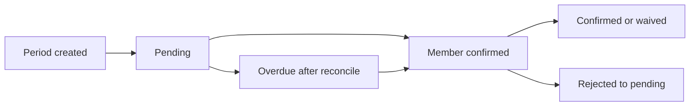

# API Design

All API routes live under `src/app/api/`. Protected routes require a valid Auth.js session. Cron routes require the `x-cron-secret` header; the expected value is the `security.cronSecret` runtime setting (see workspace settings).

## Flows

High-level pipelines implemented in code today:

### Billing lifecycle



### Notification delivery

- **Queued**: cron `enqueue-reminders` / `enqueue-follow-ups` → Mongo `ScheduledTask` → `runNotificationTasks` → worker (`src/lib/tasks/worker.ts`) → email/Telegram.
- **Manual reminders**: `POST /api/dashboard/notify-unpaid` sends aggregated reminders **inline** (not via the task queue), ignores grace period, and appends to each period’s `reminders[]` metadata. Use for on-demand nudges; automatic reminders use the queued path.
- **Task types** enqueued in production: `payment_reminder`, `aggregated_payment_reminder`, `admin_confirmation_request` only.

### Member “I paid” → admin confirmation nudge

These converge on the same enqueue + daily idempotency (one `admin_confirmation_request` task per group+period+day):

- `GET /api/confirm/[token]` (email link)
- `POST /api/groups/.../billing/[periodId]/self-confirm` (session or member portal JWT)
- Telegram member `confirm:` callback

## Authentication

### `GET/POST /api/auth/[...nextauth]`

Auth.js catch-all route. Handles sign-in, sign-out, session, and callback flows.

Configured providers:
- Credentials (email + password)
- Google OAuth
- Magic link (email)

## Groups

### `GET /api/groups`

List all groups the authenticated user belongs to (as admin or member).

**Response:**
```json
{
  "groups": [
    {
      "_id": "...",
      "name": "YouTube Premium Family",
      "service": { "name": "YouTube Premium", "icon": "🎬" },
      "role": "admin",
      "memberCount": 5,
      "billing": { "currentPrice": 18, "currency": "EUR", "mode": "equal_split" },
      "nextBillingDate": "2026-04-03",
      "unpaidCount": 2
    }
  ]
}
```

`unpaidCount` is the number of payment rows with status `pending`, `overdue`, or `member_confirmed` across **all** open billing periods for that group (`periodStart` before the current time, `isFullyPaid` false). This matches the aggregation used by `GET /api/dashboard/quick-status` for admin-owned groups.

### `POST /api/groups`

Create a new subscription group. Authenticated user becomes the admin.

**Body:**
```json
{
  "name": "YouTube Premium Family",
  "service": {
    "name": "YouTube Premium",
    "accentColor": "#3b82f6",
    "emailTheme": "clean"
  },
  "billing": {
    "mode": "equal_split",
    "currentPrice": 18,
    "currency": "EUR",
    "cycleDay": 3,
    "cycleType": "monthly",
    "adminIncludedInSplit": true,
    "gracePeriodDays": 3
  },
  "payment": {
    "platform": "revolut",
    "link": "https://revolut.me/example"
  },
  "members": [
    { "email": "alice@example.com", "nickname": "Alice" },
    { "email": "bob@example.com", "nickname": "Bob" }
  ]
}
```

### `GET /api/groups/[groupId]`

Get full group details. Admin sees everything, members see limited info.

### `PATCH /api/groups/[groupId]`

Update group settings. Admin only.

The editable payload covers general details, service (including optional
`service.accentColor` hex and `service.emailTheme` preset for notification email branding), billing configuration,
payment instructions, and the values used by the dashboard edit flow.

### `GET /api/groups/[groupId]/notification-preview`

**Deprecated** for first-party UI (the dashboard uses template helpers directly). May still be used by external clients. Returns a rendered HTML preview for payment reminder email. Admin only.

**Query params:** `type` (`payment_reminder`), `theme` (optional override: `clean` | `minimal` | `bold` | `rounded` | `corporate`)

### `DELETE /api/groups/[groupId]`

Deactivate (soft delete) a group. Admin only.

### `PATCH /api/groups/[groupId]/notifications`

Update per-group notification toggles. Admin only.

**Body:**
```json
{
  "remindersEnabled": true,
  "followUpsEnabled": true,
  "priceChangeEnabled": true
}
```

## Members

### `POST /api/groups/[groupId]/members`

Add a member to the group. Admin only. After adding, the dashboard prompts the admin to optionally send an invite email; use the send-invite endpoint to send it (or skip).

**Body:**
```json
{
  "email": "newmember@example.com",
  "nickname": "New Member",
  "customAmount": null
}
```

### `POST /api/groups/[groupId]/members/[memberId]/send-invite`

Send an invite notification (email and/or Telegram) to a single member. Admin only. Use after adding a member if the admin chose to send an invite, or to re-send an invite later.

**Response:**
```json
{
  "data": {
    "sent": true,
    "email": true,
    "telegram": false
  }
}
```

### `PATCH /api/groups/[groupId]/members/[memberId]`

Update member details (nickname, custom amount, active status). Admin only.

### `DELETE /api/groups/[groupId]/members/[memberId]`

Remove a member (soft delete — sets `leftAt` and `isActive: false`). Admin only.

## Invite link (self-join)

Admins can share a link so others can join the group without being added manually. Joining does not require login. The admin can lock registration or revoke the link at any time.

### `GET /api/groups/[groupId]/invite-link`

Get current invite-link status and URL. Admin only.

**Response:**
```json
{
  "data": {
    "inviteLinkEnabled": true,
    "inviteCode": "abc12XYZ",
    "inviteUrl": "https://app.example.com/invite/abc12XYZ"
  }
}
```

When no link exists, `inviteCode` and `inviteUrl` are `null`, and `inviteLinkEnabled` is `false`.

### `POST /api/groups/[groupId]/invite-link`

Generate or rotate the invite code and enable the link. Admin only. Returns the new invite URL.

### `PATCH /api/groups/[groupId]/invite-link`

Toggle whether registration via the link is allowed. Admin only.

**Body:**
```json
{
  "enabled": true
}
```

Set `enabled: false` to lock registration (link stays valid but no one can join until re-enabled). Set `enabled: true` to allow joining again.

### `DELETE /api/groups/[groupId]/invite-link`

Revoke the invite link (clear code and disable). Admin only. The previous link stops working.

### `GET /api/invite/[inviteCode]`

Public. Resolve an invite code and return group preview plus whether joining is currently allowed. No auth.

**Response (success):**
```json
{
  "data": {
    "groupId": "...",
    "name": "YouTube Premium Family",
    "description": null,
    "service": { "name": "YouTube Premium", "icon": null, "url": null },
    "billing": { "currentPrice": 18, "currency": "EUR", "cycleType": "monthly" },
    "canJoin": true,
    "inviteLinkEnabled": true
  }
}
```

**Error codes:** `INVITE_INVALID` (code not found or revoked), `GROUP_INACTIVE`.

### `POST /api/groups/join`

Public. Join a group via invite code. No auth. Body must include the invite code, email, and nickname.

**Body:**
```json
{
  "inviteCode": "abc12XYZ",
  "email": "newmember@example.com",
  "nickname": "New Member"
}
```

**Response (success):**
```json
{
  "data": {
    "groupId": "...",
    "member": {
      "_id": "...",
      "email": "newmember@example.com",
      "nickname": "New Member",
      "role": "member",
      "isActive": true
    }
  }
}
```

**Error codes:** `VALIDATION_ERROR`, `INVITE_INVALID`, `GROUP_INACTIVE`, `INVITE_DISABLED` (registration via link is locked), `ALREADY_MEMBER` (email already in group).

## Billing Periods

### `GET /api/groups/[groupId]/billing`

List billing periods for a group. Supports pagination and filtering.

**Query params:** `?page=1&limit=12&status=pending`

**Response:**
```json
{
  "periods": [
    {
      "_id": "...",
      "periodLabel": "Mar 2026",
      "totalPrice": 18,
      "payments": [
        {
          "memberId": "...",
          "memberNickname": "vasiliki",
          "amount": 3,
          "status": "pending"
        }
      ],
      "isFullyPaid": false
    }
  ],
  "pagination": { "page": 1, "totalPages": 3, "total": 30 }
}
```

### `POST /api/groups/[groupId]/billing`

Manually create a billing period (for variable mode). Admin only.

**Body:**
```json
{
  "periodLabel": "Mar 2026",
  "totalPrice": 22.50,
  "periodStart": "2026-03-01",
  "periodEnd": "2026-03-31"
}
```

### `POST /api/groups/[groupId]/billing/reconcile`

Re-runs equal-split / variable share math for **every** billing period on the group: updates `amount` (and clears automatic price-sync adjustments), removes payment rows for active members who are not owed for that period (e.g. billing start date after `periodStart`), and keeps rows for inactive or former members. Admin only. Empty body.

**Response:** `{ "data": { "periodsUpdated": number } }`

### `POST /api/groups/[groupId]/billing/[periodId]/recalculate`

Re-applies **equal_split** / **variable** share rules for **this period only** (same logic as full-group reconcile). Admin only. Empty body.

**Response:** `{ "data": { "_id", "periodLabel", "totalPrice", "currency", "priceNote", "payments": [...], "isFullyPaid" } }`

**Errors:** `400` if billing mode is `fixed_amount`.

### `POST /api/groups/[groupId]/billing/advance`

Create up to N **future** periods from the group’s cycle rules. Admin only.

### `POST /api/groups/[groupId]/billing/backfill`

Create up to N **past** periods (historical catch-up). Admin only.

### `POST /api/groups/[groupId]/billing/import`

Bulk-import historical periods and per-email payment rows. Admin only.

### `PATCH /api/groups/[groupId]/billing/[periodId]`

Update a billing period (change price, waive a member, add notes). Admin only.

## Payment Confirmation

### `GET /api/confirm/[token]`

Legacy email confirm handler. The token is a signed payload containing memberId, periodId, groupId. No authentication required (the token itself is the auth).

**Flow:**
1. Validate HMAC signature and expiry
2. Find the billing period and member payment
3. Set status to `member_confirmed`
4. Enqueue an `admin_confirmation_request` task and run the notification worker (admin gets Telegram when linked and Telegram notifications are on; otherwise email if allowed)
5. Redirect to member portal

New reminder emails now route members to the member portal (`/member/[token]?pay=<periodId>&open=confirm`) where they review payment details and submit confirmation from a modal.

### `POST /api/groups/[groupId]/billing/[periodId]/confirm`

Admin confirms a member's payment. Admin only.

**Body:**
```json
{
  "memberId": "...",
  "action": "confirm" | "reject" | "waive",
  "notes": "Received via Revolut"
}
```

Reject clears the member’s claim (`memberConfirmedAt`) and returns the line to `pending`, matching Telegram admin reject behavior.

### `POST /api/groups/[groupId]/billing/[periodId]/self-confirm`

Member confirms their own payment (session or `memberToken` in the body, same as other member routes). On success, enqueues `admin_confirmation_request` like the email confirm flow so the admin can verify.

## Notifications

### `POST /api/groups/[groupId]/notify`

Manually trigger notifications for a group. Admin only.

**Body:**
```json
{
  "type": "payment_reminder" | "announcement" | "price_change",
  "message": "Optional custom message",
  "channels": ["email", "telegram"]
}
```

### `GET /api/notifications`

List notifications for the authenticated user. Supports pagination.

### `GET /api/notifications?groupId=<id>&limit=<n>`

List recent notifications for a specific group. Each notification includes `status` (`sent` | `failed` | `pending`), `deliveredAt`, and `externalId` (e.g. Resend message id for email) so admins can verify delivery.

### `GET /api/notifications/templates`

Return the notification template registry, including email and Telegram previews.

### `GET /api/notifications/templates/[type]/preview`

Return a single template preview with HTML, Telegram text, and variable metadata.

**Query params:** `theme` (optional: `clean` | `minimal` | `bold` | `rounded` | `corporate`)

## Price Changes

### `POST /api/groups/[groupId]/price`

Record a price change. Admin only.

**Body:**
```json
{
  "price": 24,
  "effectiveFrom": "2026-04-01",
  "note": "YouTube increased the family plan price",
  "notifyMembers": true
}
```

## Dashboard

Admin-only endpoints for the dashboard home (quick status and bulk notify).

### `GET /api/dashboard/quick-status`

Admin-only. Counts across **active** groups where the user is the admin, using the same open-period rules as `unpaidCount` on `GET /api/groups`.

**Response `data`:**

| Field | Meaning |
| --- | --- |
| `totalGroups` | Admin-owned active groups |
| `groupsNeedingAttention` | Distinct groups with at least one outstanding payment (`pending`, `overdue`, or `member_confirmed`) |
| `groupsEligibleForReminders` | Distinct groups with at least one `pending` or `overdue` payment (matches `POST /api/dashboard/notify-unpaid`) |
| `pendingCount`, `overdueCount`, `memberConfirmedCount` | Payment-row totals across those groups |

`groupsWithPendingOverdue` is still returned for older clients; it equals `groupsNeedingAttention` (name was misleading).

### `GET /api/dashboard/notify-unpaid`

Preview unpaid reminder candidates: by group, period, and payment, with per-payment eligibility (sendEmail, sendTelegram) and skip reasons. No body. Always includes `byUser` (payments grouped by member email, case-insensitive) and `aggregateReminders: true` for the dialog UI. The app setting `notifications.aggregateReminders` applies to **cron** reminders only, not this preview.

### `POST /api/dashboard/notify-unpaid`

Send payment reminders to unpaid (pending/overdue) members. Optional body to narrow scope:

**Body (all optional):**
```json
{
  "groupIds": ["groupId1", "groupId2"],
  "paymentIds": ["paymentId1", "paymentId2"],
  "channelPreference": "email"
}
```

- `groupIds` — only process periods in these groups (must be admin’s groups). Omit for all groups.
- `paymentIds` — only send to these payment IDs. Omit for all eligible payments.
- `channelPreference` — `"email"` | `"telegram"` | `"both"` (default). For this batch, restrict to one channel or use both per member preferences.

Reminders are grouped by member email (case-insensitive): each unique email receives at most one email and one Telegram with all their unpaid amounts across groups. Response counts are per user, not per payment. Cron reminder grouping still follows the `notifications.aggregateReminders` setting.

**Response:** `{ "data": { "emailSent", "telegramSent", "skipped", "failed" } }`.

## Scheduled tasks (notification queue)

Group admins only. Lists and manages `ScheduledTask` rows for groups where the user is the admin (including aggregated reminders that reference any of those groups).

### `GET /api/scheduled-tasks`

Query: `page`, `limit` (max 50), optional `status` (`pending` \| `locked` \| `completed` \| `failed` \| `cancelled`), optional `type` (task type enum).

**Response:** `{ "data": { "items": [...], "pagination": { "page", "totalPages", "total" } } }` — each item includes `summary` and `payload` for display.

### `PATCH /api/scheduled-tasks/[taskId]`

**Body:** `{ "action": "cancel" | "retry" }`

- `cancel` — allowed only when `status` is `pending` or `locked`; sets `cancelled` and `cancelledAt`.
- `retry` — allowed only when `status` is `failed`; resets to `pending`, clears attempts/error, sets `runAt` to now.

### `POST /api/scheduled-tasks/bulk-cancel`

**Body:** at least one of `groupId`, `memberEmail`, or `type`. Cancels all **pending** and **locked** tasks matching the filters. `groupId` must be a group the admin owns. `memberEmail` matches `payload.memberEmail` on aggregated reminders (case-insensitive).

**Response:** `{ "data": { "cancelled": number } }`.

## Telegram

### `POST /api/telegram/webhook`

Telegram webhook endpoint (alternative to polling). Receives updates from Telegram Bot API. Protected by `X-Telegram-Bot-Api-Secret-Token`.

### `POST /api/telegram/link`

Generate a Telegram linking token for the authenticated user. Returns a deep link to the bot.

**Response:**
```json
{
  "botUsername": "SubsTrackBot",
  "deepLink": "https://t.me/SubsTrackBot?start=link_abc123"
}
```

## Cron Jobs

All cron routes require the `x-cron-secret` header to match the app setting `security.cronSecret`.

### `POST /api/cron/billing`

Create billing periods for subscriptions that are due. Runs reconciliation only; no notification tasks.

### `POST /api/cron/reminders`

Enqueue payment reminder tasks for unpaid periods (past grace period), then run the notification worker. Response includes `enqueued` and `worker` (claimed, completed, failed).

### `POST /api/cron/follow-ups`

Reconcile overdue payment state (pending → overdue after 14 days) and enqueue admin confirmation nudge tasks, then run the worker. Response includes `overdueReconciled`, `adminNudgesEnqueued`, and `worker`.

### `POST /api/cron/notification-tasks`

Run the notification task worker: claim due tasks, execute sends via the notification service, return counts. Intended to be called frequently (e.g. every 5 min). Response includes `claimed`, `completed`, `failed`, and `counts` (pending, locked, completed, failed, cancelled) for observability.

## User Settings

### `GET /api/user/settings`

Get authenticated user's profile and notification preferences.

### `PATCH /api/user/settings`

Update profile and notification preferences.

**Body:**
```json
{
  "name": "Nassos",
  "notificationPreferences": {
    "email": true,
    "telegram": true,
    "reminderFrequency": "every_3_days"
  }
}
```

### `POST /api/user/change-password`

Change or set the authenticated user's password (for credentials sign-in). If the user already has a password, `currentPassword` is required. If they sign in only via Google or magic link, only `newPassword` is needed.

**Body:**
```json
{
  "currentPassword": "optional when user has no password set",
  "newPassword": "8–128 characters"
}
```

**Success:** `200` with `{ "data": { "message": "Password updated." } }`.

**Errors:** `400` with code `INVALID_PASSWORD` when current password is missing (for password users) or incorrect; `400` with `VALIDATION_ERROR` for invalid or short/long new password.

## App Settings

Settings are key-value; keys include `general.appUrl`, `email.apiKey`, `email.fromAddress` (sender address for outgoing emails), optional `email.replyToAddress` (reply-to header), Telegram and security keys, etc. See the Settings UI or `src/lib/settings/definitions.ts` for the full list.

### `GET /api/settings`

List the runtime settings stored in MongoDB.

### `PATCH /api/settings`

Bulk update runtime settings.

### `POST /api/settings/test-email`

Send a test email to the authenticated user.

### `POST /api/settings/test-telegram`

Send a test Telegram message to the authenticated user if their Telegram account
is already linked.

### `GET /api/notifications/templates` and `GET /api/notifications/templates/[type]/preview`

**Deprecated** for first-party UI (template list/preview uses `@/lib/plugins/templates` in-process). Authenticated; return plugin template metadata or HTML preview.

## Dashboard and activity

### `GET /api/dashboard/quick-status`

Authenticated (admin-owned groups). See the **Dashboard** section above for response fields.

### `GET /api/dashboard/notify-unpaid`

Authenticated (admin groups). Preview of who would receive a manual unpaid reminder (`byGroup` / `byUser`, eligibility, skip reasons).

### `POST /api/dashboard/notify-unpaid`

Authenticated admin. Sends aggregated unpaid reminders; optional `groupIds`, `paymentIds`, `channelPreference` (`email` | `telegram` | `both`). Updates period `reminders[]` entries.

### `GET /api/activity`

Authenticated. Unified feed: sent notifications, audit events, and upcoming reminder/follow-up previews.

### `GET /api/payments`

Authenticated **group admin** only. Cross-group payment rows with filters and pagination; includes summary totals.

## User profile

### `GET /api/user/profile` / `PATCH /api/user/profile`

Current user profile and notification preferences.

### `POST /api/user/change-password`

Set or change password for credentials sign-in.

## Invite accept and member portal

### `GET /api/invite/accept/[token]`

Public. Accept invite token; links member to user; optional welcome notification; redirects to member portal.

### `POST /api/member/[token]/telegram-link`

Member portal JWT. Same Telegram link flow as `POST /api/telegram/link` for logged-in users.

## Plugins and misc

### `GET /api/plugins`

List installed plugins and stored config (authenticated).

### `GET /api/health`

Public liveness probe. Returns `{ "status": "ok" }` (not wrapped in `{ data }` — used by Docker healthchecks).

### `GET /api/unsubscribe/[token]`

Public. One-click email unsubscribe for a member; signed token.

## Member Requests (Phase 2)

### `POST /api/groups/[groupId]/requests`

Submit a request to the group admin. Member only.

### `GET /api/groups/[groupId]/requests`

List requests for a group. Admin sees all, members see own.

### `PATCH /api/groups/[groupId]/requests/[requestId]`

Approve or reject a request. Admin only.

## Error Response Format

All error responses follow this structure:

```json
{
  "error": {
    "code": "VALIDATION_ERROR",
    "message": "Human-readable description",
    "details": {}
  }
}
```

Common codes:
- `UNAUTHORIZED` — not authenticated
- `FORBIDDEN` — not authorized for this action
- `NOT_FOUND` — resource not found
- `VALIDATION_ERROR` — request body validation failed
- `CONFLICT` — duplicate resource (e.g. `ALREADY_MEMBER` for join)
- `INVITE_INVALID` — invite code not found or revoked
- `INVITE_DISABLED` — registration via invite link is currently locked
- `GROUP_INACTIVE` — group is deactivated
- `RATE_LIMITED` — too many requests
- `INTERNAL_ERROR` — server error
